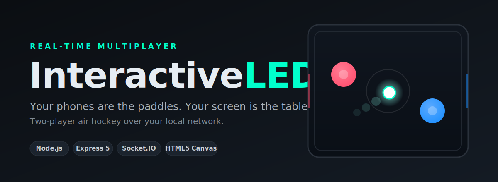

<div align="center">



**Your phones are the paddles. Your screen is the table — two-player air hockey over your local network.**

Node.js + Express + Socket.IO · HTML5 Canvas · [`display.html`](public/display.html) · [`controller.html`](public/controller.html)

---

</div>

## What it is

InteractiveLED turns any big screen into a real-time, two-player air-hockey table.
Open the display page on a TV or laptop, then each player joins from their phone and
uses the touchscreen as a paddle. Paddle positions stream to the display over
Socket.IO, and the display runs the puck physics and keeps score.

## How it works

- **`server.js`** — an Express server that serves the `public/` folder and runs a
  Socket.IO room. It enforces one display and two paddle sides (`left` / `right`),
  clamps incoming controller coordinates, and relays them to the display.
- **`public/display.html`** — the shared screen. Joins as the display, renders the
  rink, puck, and mallets on an HTML5 Canvas, applies the controller positions, runs
  the collision/physics loop, and tracks the score.
- **`public/controller.html`** — the phone paddle. Sends normalized touch coordinates
  at 40 Hz with a small deadband to cut redundant traffic.
- **`indexxx.html`** — a standalone, single-screen variant (two players on one device
  via drag or keyboard) with built-in self-tests.

## Getting started

```bash
npm install
npm start
```

The server listens on `http://localhost:3000` (override with the `PORT` environment
variable).

1. Open **`http://<host>:3000/display.html`** on the shared screen (TV or laptop).
2. On each phone, open **`http://<host>:3000/controller.html`**, pick a side
   (P1 left / P2 right), and tap **Rejoindre**.
3. Drag on the phone to move your paddle. First side to defend its goal wins the rally.

Replace `<host>` with the machine's LAN IP so phones on the same network can reach it.

## Controls

| Page | Player | Input |
| --- | --- | --- |
| `controller.html` | P1 / P2 | Drag anywhere on the touch pad |
| `indexxx.html` | P1 | Drag in the left half, or `Z` `Q` `S` `D` |
| `indexxx.html` | P2 | Drag in the right half, or arrow keys |

An optional `logo.png` in `public/` replaces the puck with your image when present.

## Tech stack

- **Runtime:** Node.js
- **Server:** Express 5, Socket.IO 4
- **Client:** HTML5 Canvas, vanilla JavaScript (no build step)
